# Anzahl Teilnahmen pro Anlass

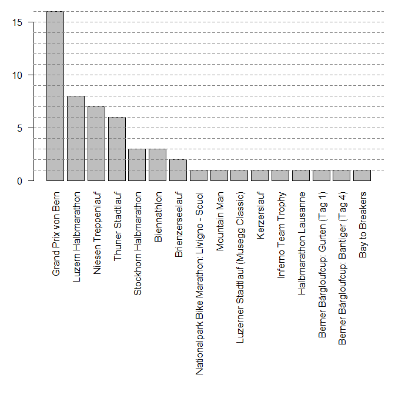

# Anzahl Teilnahmen pro Jahr und Disziplin

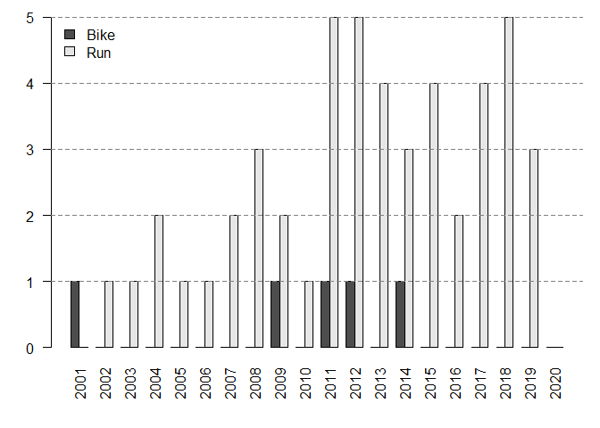

Bis jetzt habe ich an 49 Laeufen und 5 Bikerennen teilgenommen.

# Teilnahmen pro Anlass

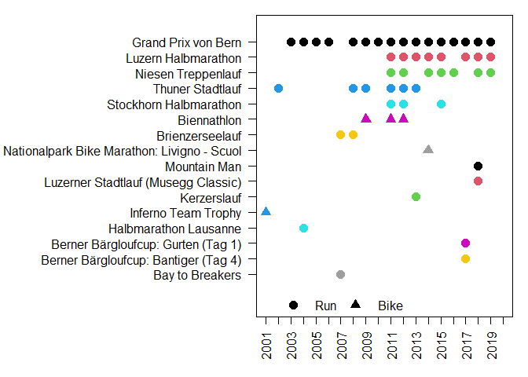

# Relative Ränge und Zeiten 

Grafiken werden nur für Wettkämpfe mit mind. 2 Teilnahmen gezeigt. Für alle anderen Wettkämpfe wird nur eine Tabelle mit den Zeiten gezeigt.

## Grand Prix von Bern {.tabset .tabset-fade .tabset-pills}

### Relativer Rang Kategorie

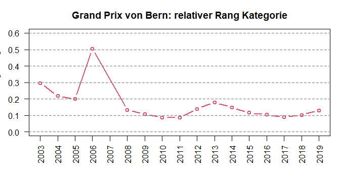

### Relativer Range Männer

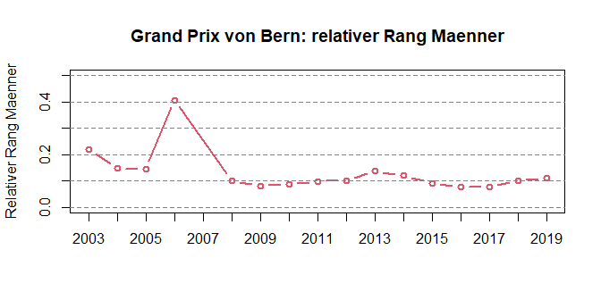

### Zeit

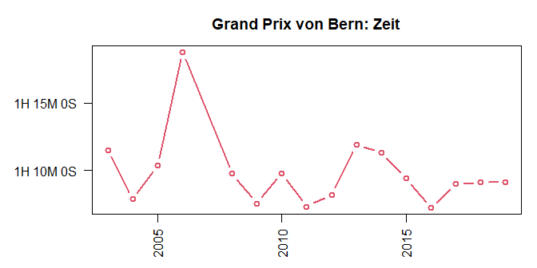

### Tabelle Zeiten

----------------------------------------
 Jahr         Anlass            Zeit    
------ --------------------- -----------
 2003   Grand Prix von Bern   1:11:30.6 

 2004   Grand Prix von Bern   1:07:52.7 

 2005   Grand Prix von Bern   1:10:22.9 

 2006   Grand Prix von Bern   1:18:44.8 

 2008   Grand Prix von Bern   1:09:46.0 

 2009   Grand Prix von Bern   1:07:34.0 

 2010   Grand Prix von Bern   1:09:47.9 

 2011   Grand Prix von Bern   1:07:20.5 

 2012   Grand Prix von Bern   1:08:13.3 

 2013   Grand Prix von Bern   1:11:54.3 

 2014   Grand Prix von Bern   1:11:19.8 

 2015   Grand Prix von Bern   1:09:25.0 

 2016   Grand Prix von Bern   1:07:13.9 

 2017   Grand Prix von Bern   1:09:00.0 

 2018   Grand Prix von Bern   1:09:09.1 

 2019   Grand Prix von Bern   1:09:08.3 
----------------------------------------

## Luzern Halbmarathon {.tabset .tabset-fade .tabset-pills}

### Relativer Rang Kategorie

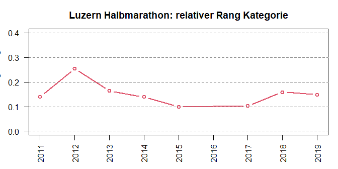

### Relativer Range Männer

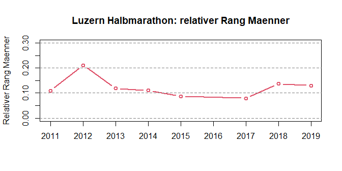

### Zeit

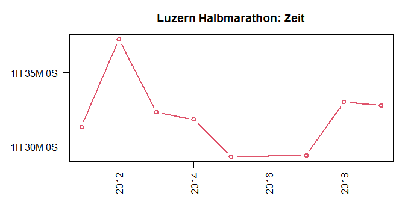

### Tabelle Zeiten

----------------------------------------
 Jahr         Anlass            Zeit    
------ --------------------- -----------
 2011   Luzern Halbmarathon   1:31:19.3 

 2012   Luzern Halbmarathon   1:37:13.6 

 2013   Luzern Halbmarathon   1:32:20.1 

 2014   Luzern Halbmarathon   1:31:50.3 

 2015   Luzern Halbmarathon   1:29:19.9 

 2017   Luzern Halbmarathon   1:29:25.4 

 2018   Luzern Halbmarathon   1:33:01.2 

 2019   Luzern Halbmarathon   1:32:47.8 
----------------------------------------

## Niesen Treppenlauf {.tabset .tabset-fade .tabset-pills}

### Relativer Rang Kategorie

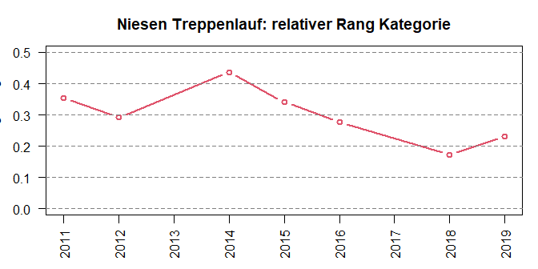

### Relativer Range Männer

### Zeit

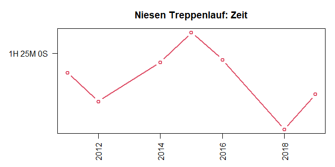

### Tabelle Zeiten

---------------------------------------
 Jahr         Anlass           Zeit    
------ -------------------- -----------
 2011   Niesen Treppenlauf   1:24:00.0 

 2012   Niesen Treppenlauf   1:22:30.0 

 2014   Niesen Treppenlauf   1:24:32.0 

 2015   Niesen Treppenlauf   1:26:05.0 

 2016   Niesen Treppenlauf   1:24:40.0 

 2018   Niesen Treppenlauf   1:21:01.7 

 2019   Niesen Treppenlauf   1:22:52.0 
---------------------------------------

## Thuner Stadtlauf {.tabset .tabset-fade .tabset-pills}

### Relativer Rang Kategorie

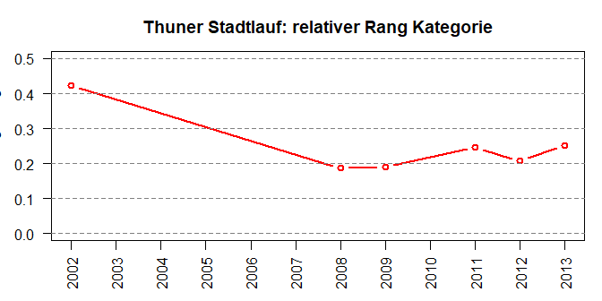

### Relativer Range Männer

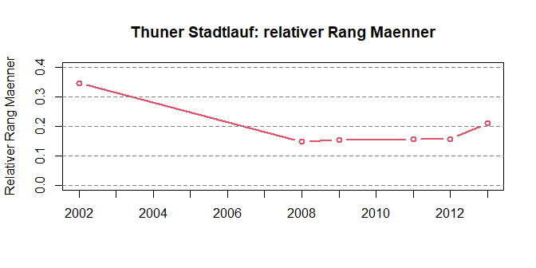

### Zeit

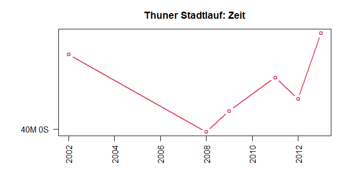

### Tabelle Zeiten

-------------------------------------
 Jahr        Anlass          Zeit    
------ ------------------ -----------
 2002   Thuner Stadtlauf   0:40:47.7 

 2008   Thuner Stadtlauf   0:39:58.1 

 2009   Thuner Stadtlauf   0:40:11.7 

 2011   Thuner Stadtlauf   0:40:33.1 

 2012   Thuner Stadtlauf   0:40:19.2 

 2013   Thuner Stadtlauf   0:41:01.5 
-------------------------------------

## Stockhorn Halbmarathon {.tabset .tabset-fade .tabset-pills}

### Relativer Rang Kategorie

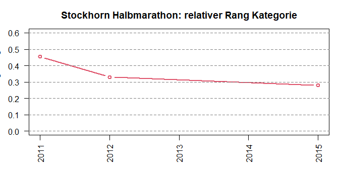

### Relativer Range Männer

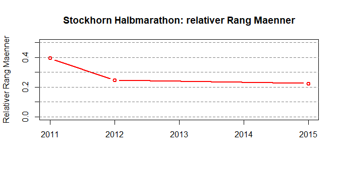

### Zeit

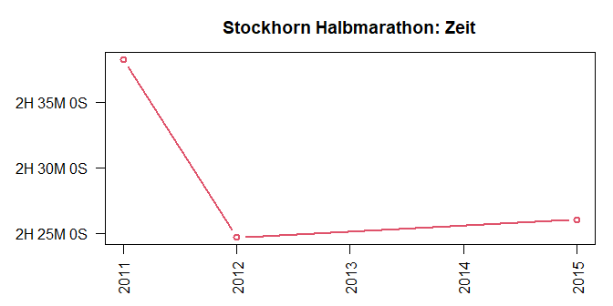

### Tabelle Zeiten

-------------------------------------------
 Jahr           Anlass             Zeit    
------ ------------------------ -----------
 2011   Stockhorn Halbmarathon   2:38:15.0 

 2012   Stockhorn Halbmarathon   2:24:41.0 

 2015   Stockhorn Halbmarathon   2:26:03.0 
-------------------------------------------

## Biennathlon {.tabset .tabset-fade .tabset-pills}

---------------------------
 Jahr     Anlass      Zeit 
------ ------------- ------
 2009   Biennathlon    NA  

 2011   Biennathlon    NA  

 2012   Biennathlon    NA  
---------------------------

## Brienzerseelauf {.tabset .tabset-fade .tabset-pills}

### Relativer Rang Kategorie

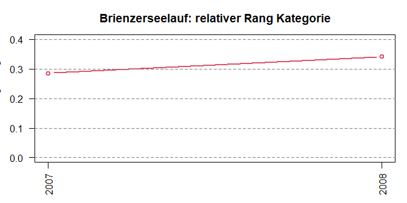

### Relativer Range Männer

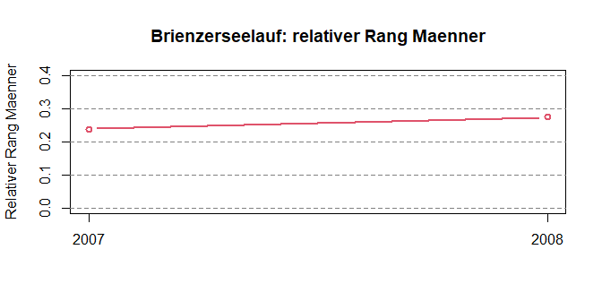

### Zeit

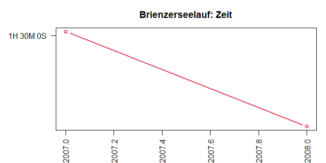

### Tabelle Zeiten

------------------------------------
 Jahr       Anlass          Zeit    
------ ----------------- -----------
 2007   Brienzerseelauf   1:30:02.0 

 2008   Brienzerseelauf   1:29:13.0 
------------------------------------

## Nationalpark Bike Marathon: Livigno - Scuol {.tabset .tabset-fade .tabset-pills}

------------------------------------------------
 Jahr             Anlass                Zeit    
------ ----------------------------- -----------
 2014   Nationalpark Bike Marathon:   3:39:28.0 
              Livigno - Scuol                   
------------------------------------------------

## Mountain Man {.tabset .tabset-fade .tabset-pills}

---------------------------------
 Jahr      Anlass        Zeit    
------ -------------- -----------
 2018   Mountain Man   2:31:06.0 
---------------------------------

## Luzerner Stadtlauf (Musegg Classic) {.tabset .tabset-fade .tabset-pills}

-----------------------------------------------
 Jahr             Anlass               Zeit    
------ ---------------------------- -----------
 2018   Luzerner Stadtlauf (Musegg   0:28:32.2 
                 Classic)                      
-----------------------------------------------

## Kerzerslauf {.tabset .tabset-fade .tabset-pills}

--------------------------------
 Jahr     Anlass        Zeit    
------ ------------- -----------
 2013   Kerzerslauf   1:06:17.1 
--------------------------------

## Inferno Team Trophy {.tabset .tabset-fade .tabset-pills}

-----------------------------------
 Jahr         Anlass          Zeit 
------ --------------------- ------
 2001   Inferno Team Trophy    NA  
-----------------------------------

## Halbmarathon Lausanne {.tabset .tabset-fade .tabset-pills}

------------------------------------------
 Jahr          Anlass             Zeit    
------ ----------------------- -----------
 2004   Halbmarathon Lausanne   1:34:34.0 
------------------------------------------

## Berner Bärgloufcup: Gurten (Tag 1) {.tabset .tabset-fade .tabset-pills}

-----------------------------------------------
 Jahr             Anlass               Zeit    
------ ---------------------------- -----------
 2017  Berner Bärgloufcup: Gurten   0:19:54.0 
                 (Tag 1)                       
-----------------------------------------------

## Berner Bärgloufcup: Bantiger (Tag 4) {.tabset .tabset-fade .tabset-pills}

-------------------------------------------------
 Jahr              Anlass                Zeit    
------ ------------------------------ -----------
 2017  Berner Bärgloufcup: Bantiger   0:26:24.0 
                  (Tag 4)                        
-------------------------------------------------

## Bay to Breakers {.tabset .tabset-fade .tabset-pills}

------------------------------------
 Jahr       Anlass          Zeit    
------ ----------------- -----------
 2007   Bay to Breakers   1:13:26.0 
------------------------------------

# Innerhalb Maenner ueber alle Wettkaempfe

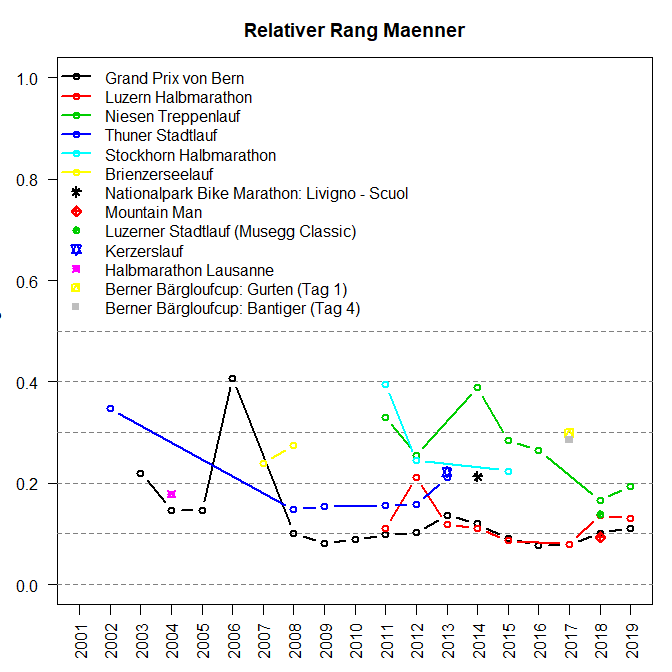

# Innerhalb Alterskategorie ueber alle Wettkaempfe

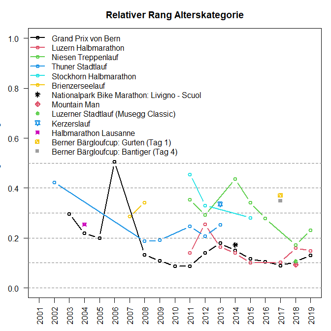
