# Analyse

------------------------------------------------------------------------
         &nbsp;              Kieser     Exersuisse    Kieser 2    Total 
------------------------- ------------ ------------ ------------ -------
    Anzahl Programme           16           27           7         50   

    Anzahl Trainings          305          506          109        920  

     Erstes Training       2005-05-07   2011-01-12   2017-11-23         

 Bisher letztes Training   2011-01-10   2017-11-15   2019-11-20         
------------------------------------------------------------------------

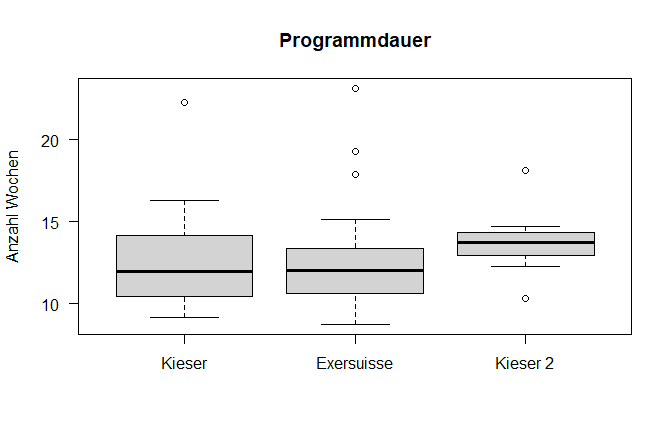

# Uebungen des letzten absolvierten Programms

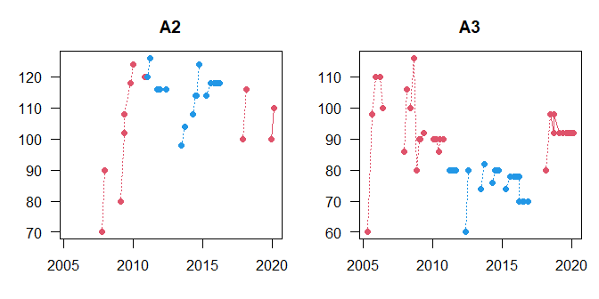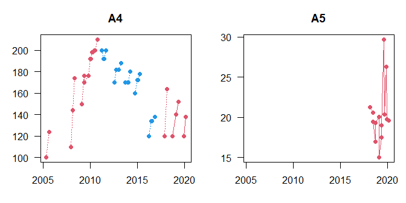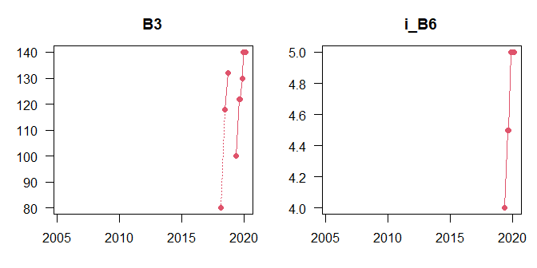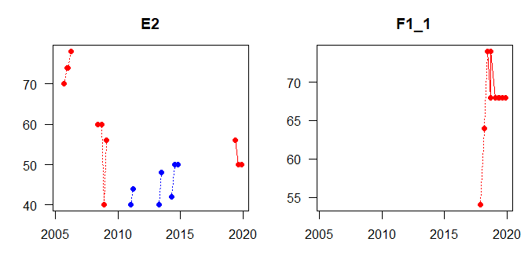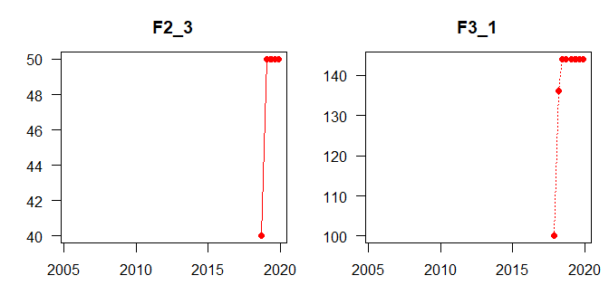

# Alle Uebungen

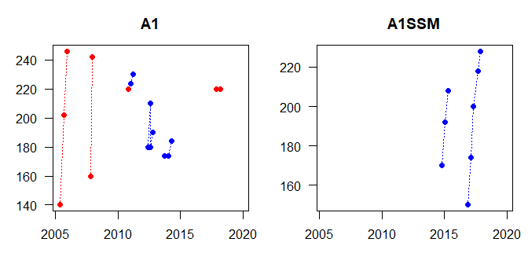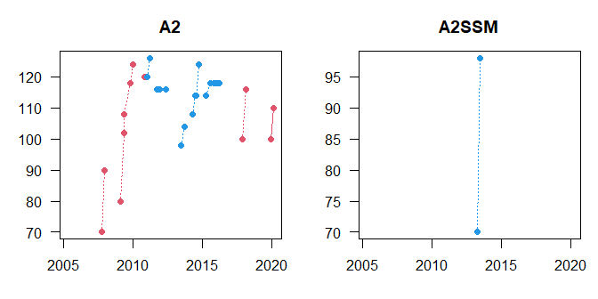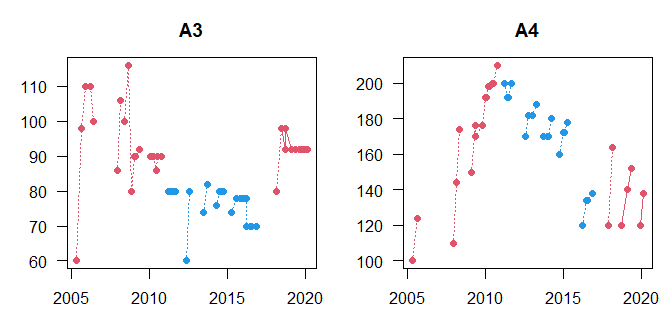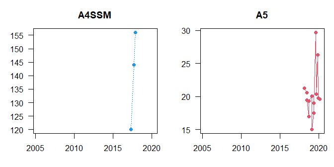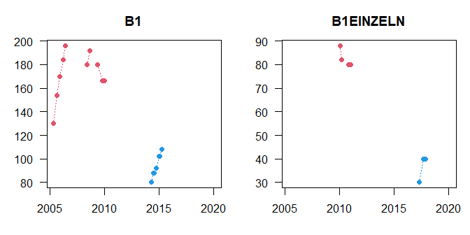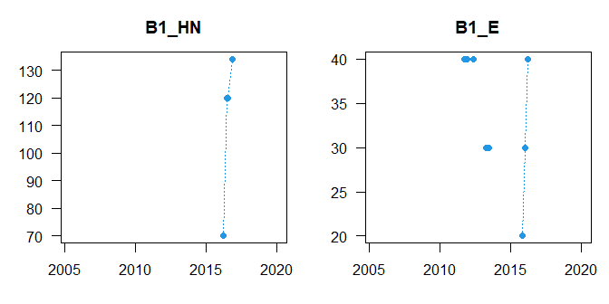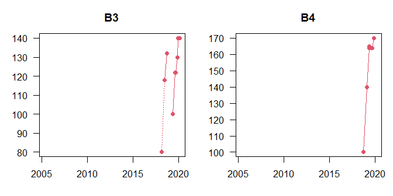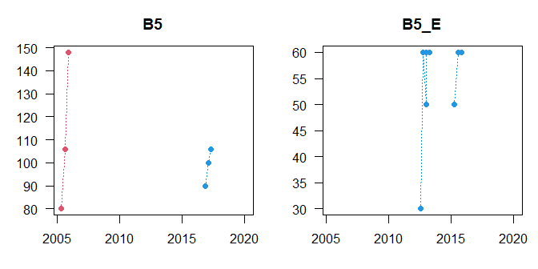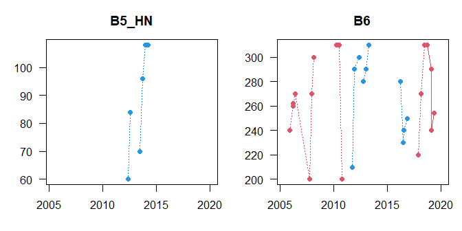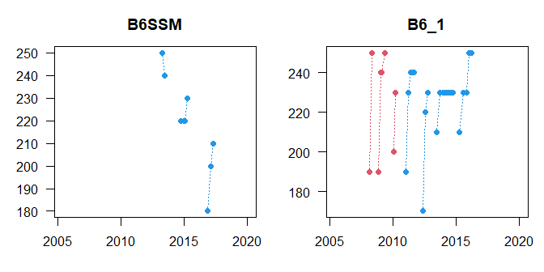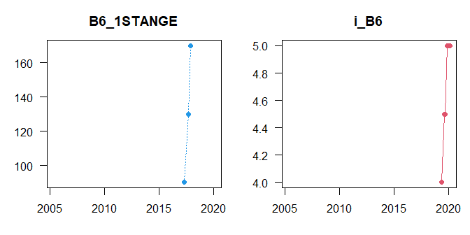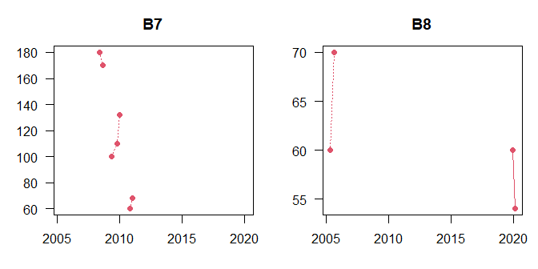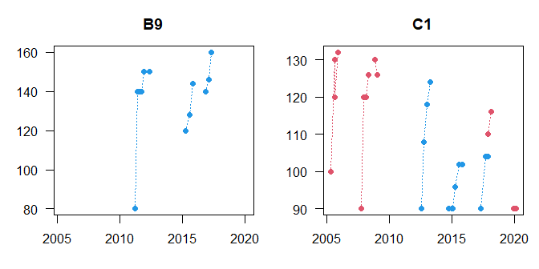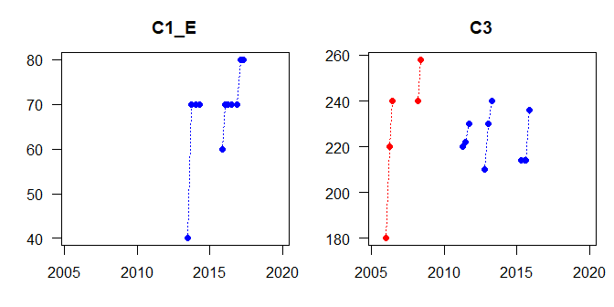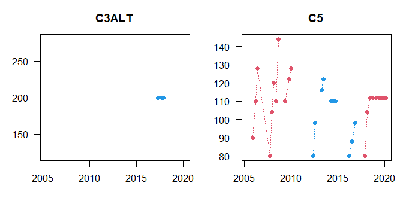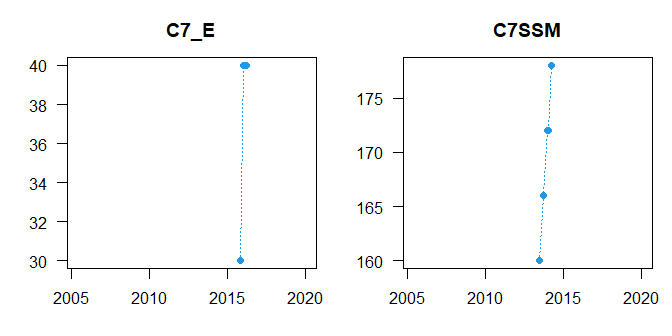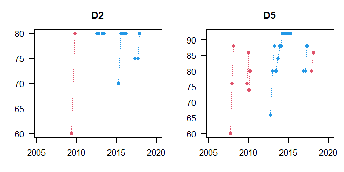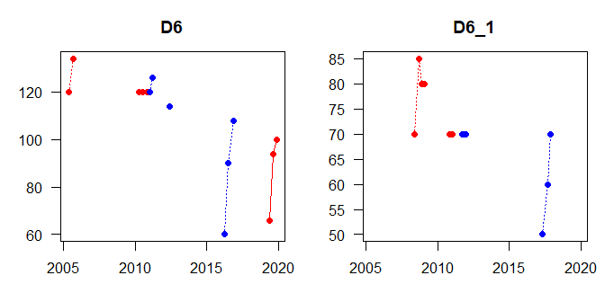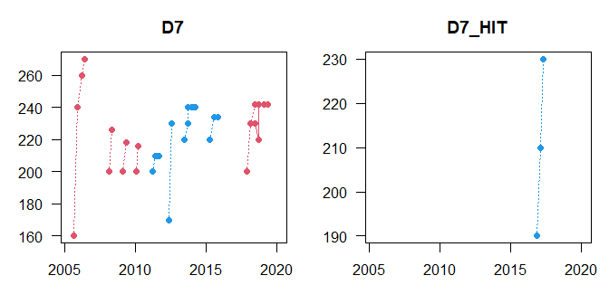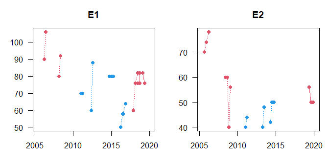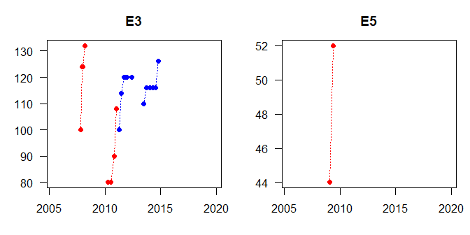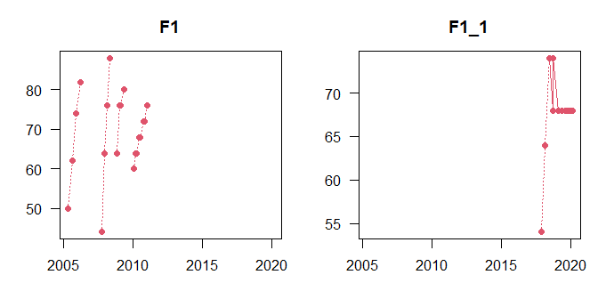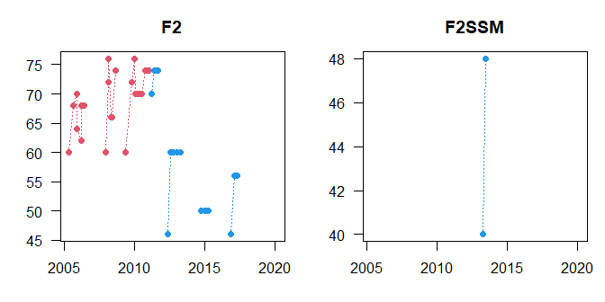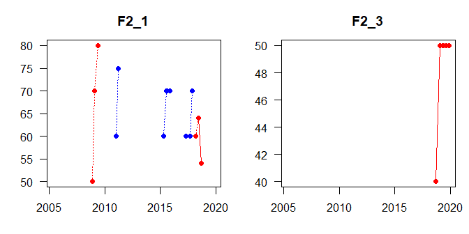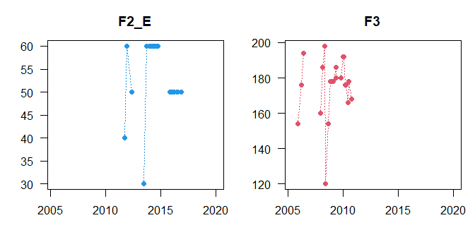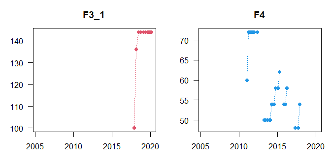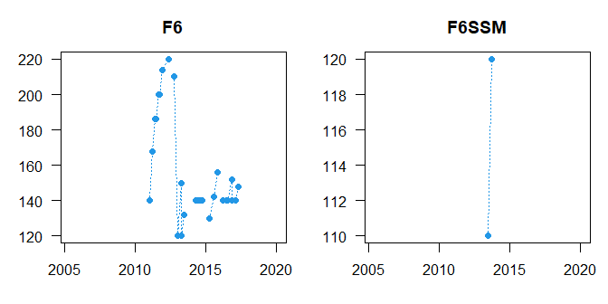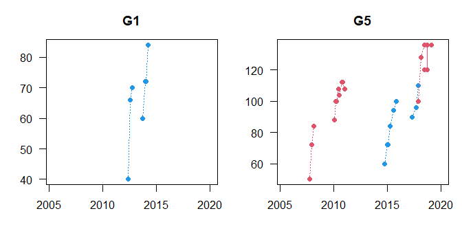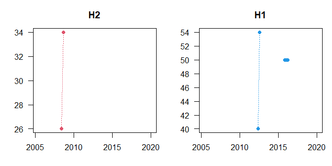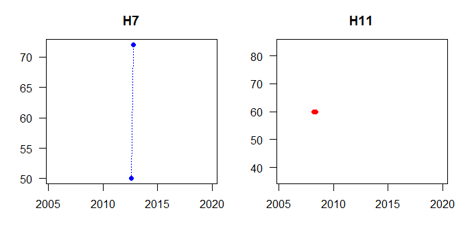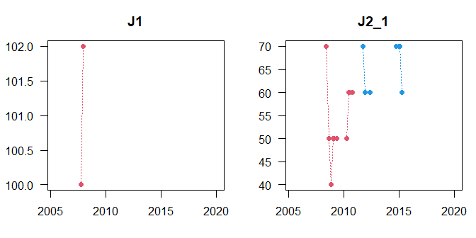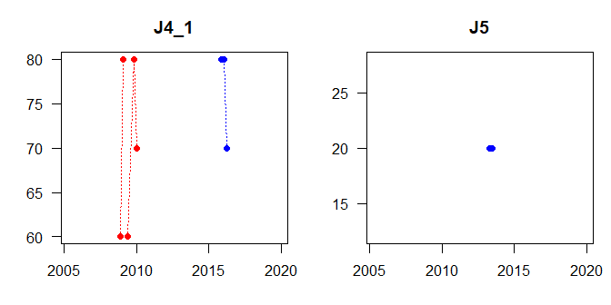

