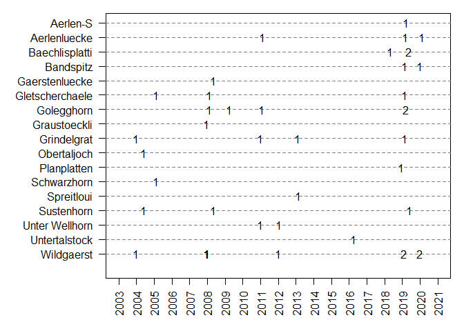
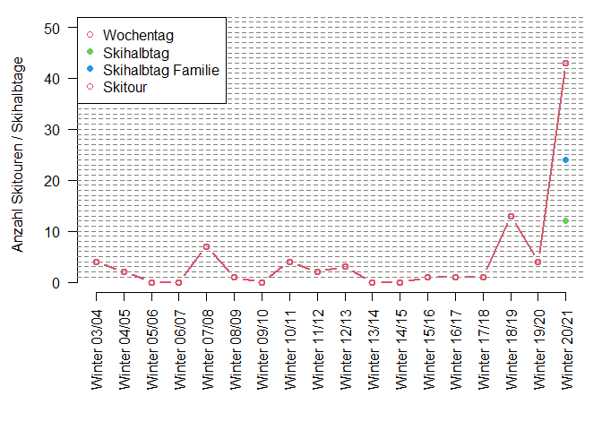

# Summary over years

List by far not complete. Multiple tours within same month are pooled and frequency is given.

# Listings

This section provides listings, chronologically and by time. For listings by time, tours with missing time are omitted.

## Aerlen-S {.tabset .tabset-fade .tabset-pills}

### Chronologically

------------------------------------------------------------------------------
           start             via1   via2     end         date         time    
--------------------------- ------ ------ ---------- ------------ ------------
 Handeck Kurve nach Mineur                 Aerlen-S   2019-03-20   02:41:25.0 
------------------------------------------------------------------------------

### By time

------------------------------------------------------------------------------
           start             via1   via2     end         date         time    
--------------------------- ------ ------ ---------- ------------ ------------
 Handeck Kurve nach Mineur                 Aerlen-S   2019-03-20   02:41:25.0 
------------------------------------------------------------------------------

## Aerlenluecke {.tabset .tabset-fade .tabset-pills}

### Chronologically

----------------------------------------------------------------------------------
           start             via1   via2       end           date         time    
--------------------------- ------ ------ -------------- ------------ ------------
      Handeck Mineur                       Aerlenluecke   2020-02-08   03:38:24.8 

 Handeck Kurve nach Mineur                 Aerlenluecke   2019-03-03   04:10:41.3 

       Handeck Hotel                       Aerlenluecke   2011-02-06   03:15:00.0 
----------------------------------------------------------------------------------

### By time

----------------------------------------------------------------------------------
           start             via1   via2       end           date         time    
--------------------------- ------ ------ -------------- ------------ ------------
       Handeck Hotel                       Aerlenluecke   2011-02-06   03:15:00.0 

      Handeck Mineur                       Aerlenluecke   2020-02-08   03:38:24.8 

 Handeck Kurve nach Mineur                 Aerlenluecke   2019-03-03   04:10:41.3 
----------------------------------------------------------------------------------

## Baechlisplatti {.tabset .tabset-fade .tabset-pills}

### Chronologically

------------------------------------------------------------------------
     start       via1   via2        end            date         time    
--------------- ------ ------ ---------------- ------------ ------------
  Gerstenegg                   Baechlisplatti   2019-05-31   02:15:19.9 

  Gerstenegg                   Baechlisplatti   2019-05-24   01:56:25.9 

 Kunzentennlen                 Baechlisplatti   2018-04-25   03:26:50.3 
------------------------------------------------------------------------

### By time

------------------------------------------------------------------------
     start       via1   via2        end            date         time    
--------------- ------ ------ ---------------- ------------ ------------
  Gerstenegg                   Baechlisplatti   2019-05-24   01:56:25.9 

  Gerstenegg                   Baechlisplatti   2019-05-31   02:15:19.9 

 Kunzentennlen                 Baechlisplatti   2018-04-25   03:26:50.3 
------------------------------------------------------------------------

## Bandspitz {.tabset .tabset-fade .tabset-pills}

### Chronologically

--------------------------------------------------------------------
     start        via1   via2      end         date         time    
---------------- ------ ------ ----------- ------------ ------------
 Schwarzwaldalp                 Bandspitz   2020-01-02   01:43:57.0 

 Schwarzwaldalp                 Bandspitz   2019-02-14   01:40:51.8 
--------------------------------------------------------------------

### By time

--------------------------------------------------------------------
     start        via1   via2      end         date         time    
---------------- ------ ------ ----------- ------------ ------------
 Schwarzwaldalp                 Bandspitz   2019-02-14   01:40:51.8 

 Schwarzwaldalp                 Bandspitz   2020-01-02   01:43:57.0 
--------------------------------------------------------------------

## Gaerstenluecke {.tabset .tabset-fade .tabset-pills}

### Chronologically

----------------------------------------------------------
 start   via1   via2        end            date      time 
------- ------ ------ ---------------- ------------ ------
                       Gaerstenluecke   2008-05-03        
----------------------------------------------------------

### By time

----------- ---------- ---------- --------- ---------- ----------
 **start**   **via1**   **via2**   **end**   **date**   **time** 

----------- ---------- ---------- --------- ---------- ----------

## Gletscherchaele {.tabset .tabset-fade .tabset-pills}

### Chronologically

----------------------------------------------------------------------------
      start         via1   via2         end            date         time    
------------------ ------ ------ ----------------- ------------ ------------
 Guttannen Tunnel                 Gletscherchaele   2019-02-16   04:58:18.9 

                                  Gletscherchaele   2008-02-17              

                                  Gletscherchaele   2005-02-11              
----------------------------------------------------------------------------

### By time

----------------------------------------------------------------------------
      start         via1   via2         end            date         time    
------------------ ------ ------ ----------------- ------------ ------------
 Guttannen Tunnel                 Gletscherchaele   2019-02-16   04:58:18.9 
----------------------------------------------------------------------------

## Golegghorn {.tabset .tabset-fade .tabset-pills}

### Chronologically

--------------------------------------------------------------------------------
           start             via1   via2      end          date         time    
--------------------------- ------ ------ ------------ ------------ ------------
 Handeck Kurve nach Mineur                 Golegghorn   2019-03-24   03:38:01.7 

 Handeck Kurve nach Mineur                 Golegghorn   2019-03-23   03:14:13.4 

       Handeck Hotel                       Golegghorn   2011-01-30   03:25:00.0 

                                           Golegghorn   2009-04-05              

       Handeck Hotel                       Golegghorn   2008-02-16   03:20:00.0 
--------------------------------------------------------------------------------

### By time

--------------------------------------------------------------------------------
           start             via1   via2      end          date         time    
--------------------------- ------ ------ ------------ ------------ ------------
 Handeck Kurve nach Mineur                 Golegghorn   2019-03-23   03:14:13.4 

       Handeck Hotel                       Golegghorn   2008-02-16   03:20:00.0 

       Handeck Hotel                       Golegghorn   2011-01-30   03:25:00.0 

 Handeck Kurve nach Mineur                 Golegghorn   2019-03-24   03:38:01.7 
--------------------------------------------------------------------------------

## Graustoeckli {.tabset .tabset-fade .tabset-pills}

### Chronologically

--------------------------------------------------------
 start   via1   via2       end           date      time 
------- ------ ------ -------------- ------------ ------
                       Graustoeckli   2007-12-23        
--------------------------------------------------------

### By time

----------- ---------- ---------- --------- ---------- ----------
 **start**   **via1**   **via2**   **end**   **date**   **time** 

----------- ---------- ---------- --------- ---------- ----------

## Grindelgrat {.tabset .tabset-fade .tabset-pills}

### Chronologically

-----------------------------------------------------------------------
      start        via1   via2       end          date         time    
----------------- ------ ------ ------------- ------------ ------------
 Gschwandtenmaad                 Grindelgrat   2020-12-10   02:23:22.0 

 Schwarzwaldalp                  Grindelgrat   2019-02-20   01:54:15.8 

 Gschwandtenmaad                 Grindelgrat   2013-02-10   03:05:41.2 

                                 Grindelgrat   2010-12-30              

                                 Grindelgrat   2003-12-25              
-----------------------------------------------------------------------

### By time

-----------------------------------------------------------------------
      start        via1   via2       end          date         time    
----------------- ------ ------ ------------- ------------ ------------
 Schwarzwaldalp                  Grindelgrat   2019-02-20   01:54:15.8 

 Gschwandtenmaad                 Grindelgrat   2020-12-10   02:23:22.0 

 Gschwandtenmaad                 Grindelgrat   2013-02-10   03:05:41.2 
-----------------------------------------------------------------------

## Gummen {.tabset .tabset-fade .tabset-pills}

### Chronologically

--------------------------------------------------------
 start   via1   via2    end        date         time    
------- ------ ------ -------- ------------ ------------
 Reuti                 Gummen   2020-12-07   02:17:20.0 
--------------------------------------------------------

### By time

--------------------------------------------------------
 start   via1   via2    end        date         time    
------- ------ ------ -------- ------------ ------------
 Reuti                 Gummen   2020-12-07   02:17:20.0 
--------------------------------------------------------

## Obertaljoch {.tabset .tabset-fade .tabset-pills}

### Chronologically

-------------------------------------------------------
 start   via1   via2       end          date      time 
------- ------ ------ ------------- ------------ ------
                       Obertaljoch   2004-05-27        
-------------------------------------------------------

### By time

----------- ---------- ---------- --------- ---------- ----------
 **start**   **via1**   **via2**   **end**   **date**   **time** 

----------- ---------- ---------- --------- ---------- ----------

## Planplatten {.tabset .tabset-fade .tabset-pills}

### Chronologically

-------------------------------------------------------------
 start   via1   via2       end          date         time    
------- ------ ------ ------------- ------------ ------------
 Reuti                 Planplatten   2020-12-21   01:59:54.0 

 Reuti                 Planplatten   2020-12-19   01:42:21.5 

 Reuti                 Planplatten   2020-12-08   02:18:22.0 

 Reuti                 Planplatten   2018-12-13   02:12:01.6 
-------------------------------------------------------------

### By time

-------------------------------------------------------------
 start   via1   via2       end          date         time    
------- ------ ------ ------------- ------------ ------------
 Reuti                 Planplatten   2020-12-19   01:42:21.5 

 Reuti                 Planplatten   2020-12-21   01:59:54.0 

 Reuti                 Planplatten   2018-12-13   02:12:01.6 

 Reuti                 Planplatten   2020-12-08   02:18:22.0 
-------------------------------------------------------------

## Schwarzhorn {.tabset .tabset-fade .tabset-pills}

### Chronologically

-------------------------------------------------------
 start   via1   via2       end          date      time 
------- ------ ------ ------------- ------------ ------
                       Schwarzhorn   2005-02-06        
-------------------------------------------------------

### By time

----------- ---------- ---------- --------- ---------- ----------
 **start**   **via1**   **via2**   **end**   **date**   **time** 

----------- ---------- ---------- --------- ---------- ----------

## Spreitloui {.tabset .tabset-fade .tabset-pills}

### Chronologically

------------------------------------------------------
 start   via1   via2      end          date      time 
------- ------ ------ ------------ ------------ ------
                       Spreitloui   2013-02-18        
------------------------------------------------------

### By time

----------- ---------- ---------- --------- ---------- ----------
 **start**   **via1**   **via2**   **end**   **date**   **time** 

----------- ---------- ---------- --------- ---------- ----------

## Sustenhorn {.tabset .tabset-fade .tabset-pills}

### Chronologically

---------------------------------------------------------------------
     start        via1   via2      end          date         time    
---------------- ------ ------ ------------ ------------ ------------
 Steingletscher                 Sustenhorn   2019-06-01   03:12:22.8 

 Steingletscher                 Sustenhorn   2008-05-12   03:00:00.0 

                                Sustenhorn   2004-05-28              
---------------------------------------------------------------------

### By time

---------------------------------------------------------------------
     start        via1   via2      end          date         time    
---------------- ------ ------ ------------ ------------ ------------
 Steingletscher                 Sustenhorn   2008-05-12   03:00:00.0 

 Steingletscher                 Sustenhorn   2019-06-01   03:12:22.8 
---------------------------------------------------------------------

## Unter Wellhorn {.tabset .tabset-fade .tabset-pills}

### Chronologically

----------------------------------------------------------
 start   via1   via2        end            date      time 
------- ------ ------ ---------------- ------------ ------
                       Unter Wellhorn   2012-01-17        

                       Unter Wellhorn   2010-12-27        
----------------------------------------------------------

### By time

----------- ---------- ---------- --------- ---------- ----------
 **start**   **via1**   **via2**   **end**   **date**   **time** 

----------- ---------- ---------- --------- ---------- ----------

## Untertalstock {.tabset .tabset-fade .tabset-pills}

### Chronologically

------------------------------------------------------------------
  start     via1   via2        end           date         time    
---------- ------ ------ --------------- ------------ ------------
 Feldmoos                 Untertalstock   2016-03-31   02:51:59.8 
------------------------------------------------------------------

### By time

------------------------------------------------------------------
  start     via1   via2        end           date         time    
---------- ------ ------ --------------- ------------ ------------
 Feldmoos                 Untertalstock   2016-03-31   02:51:59.8 
------------------------------------------------------------------

## Wildgaerst {.tabset .tabset-fade .tabset-pills}

### Chronologically

---------------------------------------------------------------------
     start        via1   via2      end          date         time    
---------------- ------ ------ ------------ ------------ ------------
 Schwarzwaldalp                 Wildgaerst   2020-12-14   02:59:58.0 

 Schwarzwaldalp                 Wildgaerst   2019-12-30   02:57:19.5 

 Schwarzwaldalp                 Wildgaerst   2019-12-29   02:15:47.4 

 Schwarzwaldalp                 Wildgaerst   2019-02-19   02:59:45.5 

 Schwarzwaldalp                 Wildgaerst   2019-02-13   02:46:49.0 

 Schwarzwaldalp                 Wildgaerst   2012-01-12   02:35:00.0 

                                Wildgaerst   2008-01-01              

 Schwarzwaldalp                 Wildgaerst   2007-12-25   02:40:00.0 

                                Wildgaerst   2004-01-01              
---------------------------------------------------------------------

### By time

---------------------------------------------------------------------
     start        via1   via2      end          date         time    
---------------- ------ ------ ------------ ------------ ------------
 Schwarzwaldalp                 Wildgaerst   2019-12-29   02:15:47.4 

 Schwarzwaldalp                 Wildgaerst   2012-01-12   02:35:00.0 

 Schwarzwaldalp                 Wildgaerst   2007-12-25   02:40:00.0 

 Schwarzwaldalp                 Wildgaerst   2019-02-13   02:46:49.0 

 Schwarzwaldalp                 Wildgaerst   2019-12-30   02:57:19.5 

 Schwarzwaldalp                 Wildgaerst   2019-02-19   02:59:45.5 

 Schwarzwaldalp                 Wildgaerst   2020-12-14   02:59:58.0 
---------------------------------------------------------------------

