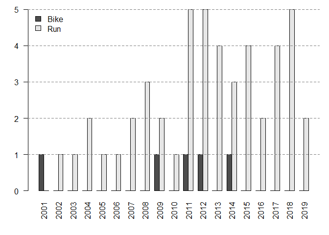
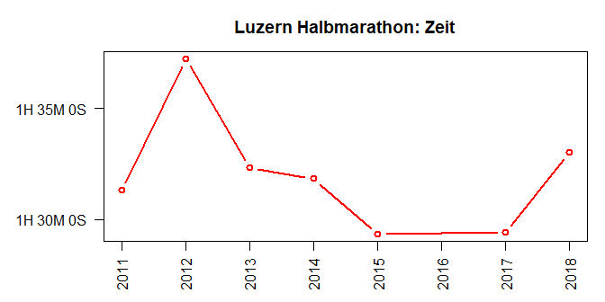
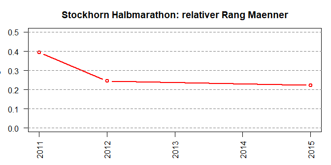
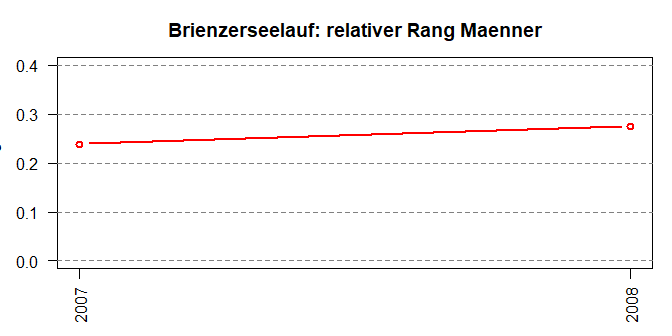
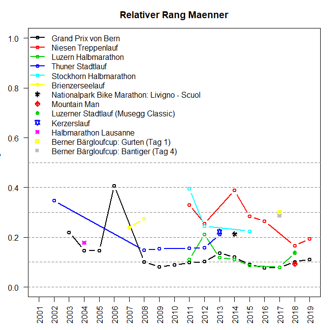

Wettkaempfe
================
Kaspar Rufibach
27 Aug 2019

# Anzahl Teilnahmen pro Anlass

# Anzahl Teilnahmen pro Jahr und Disziplin

Bis jetzt habe ich an 48 Laeufen und 5 Bikerennen
teilgenommen.

# Teilnahmen pro Anlass ueber die Zeit

# Alle Wettkaempfe

Es werden nur Wettkaempfe mit mind. 2 Teilnahmen
gezeigt.

    ## Grand Prix von Bern

    ## Niesen Treppenlauf

    ## Luzern Halbmarathon

    ## Thuner Stadtlauf

    ## Stockhorn Halbmarathon

    ## Brienzerseelauf

# Relative Raenge

## Innerhalb Maenner ueber alle Wettkaempfe

## Innerhalb Alterskategorie ueber alle Wettkaempfe

