Wettkaempfe
================
Kaspar Rufibach
10 Nov 2018

Anzahl Teilnahmen pro Anlass
============================

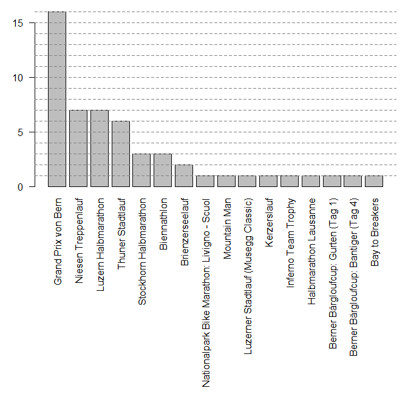

Anzahl Teilnahmen pro Jahr und Disziplin
========================================

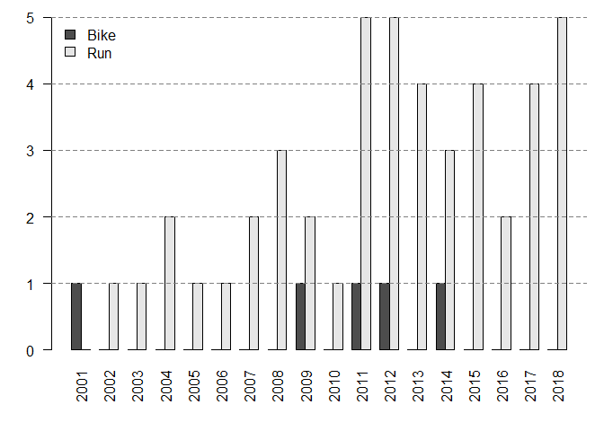

Bis jetzt habe ich an 46 Laeufen und 5 Bikerennen teilgenommen.

Alle Wettkaempfe
================

Es werden nur Wettkaempfe mit mind. 2 Teilnahmen gezeigt.

    ## Grand Prix von Bern

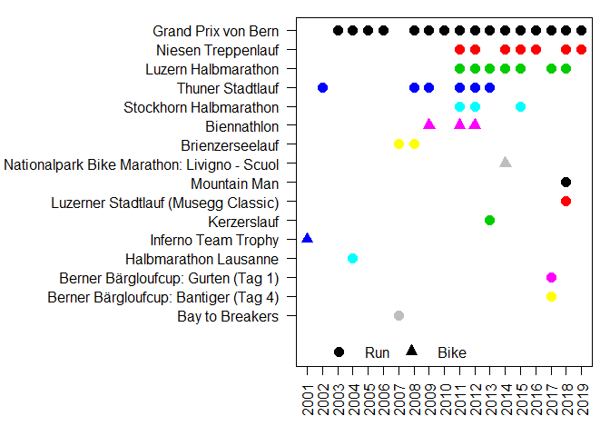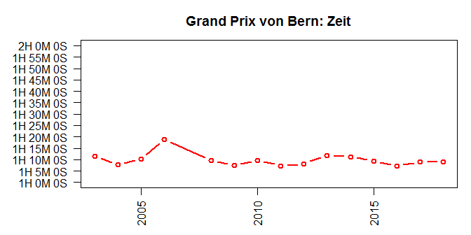

    ## 
    ## Luzern Halbmarathon

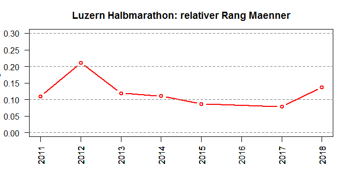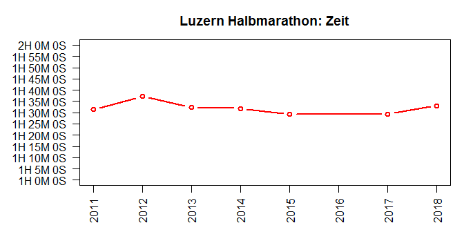

    ## 
    ## Thuner Stadtlauf

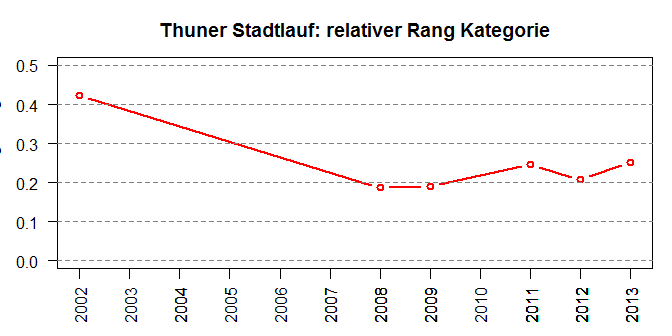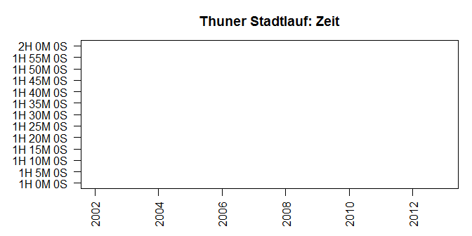

    ## 
    ## Niesen Treppenlauf

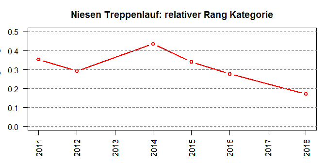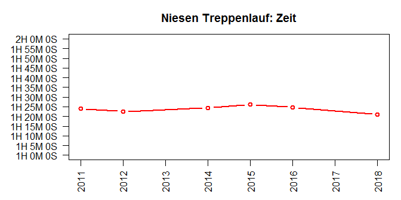

    ## 
    ## Stockhorn Halbmarathon

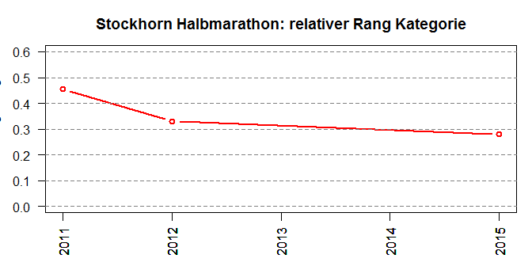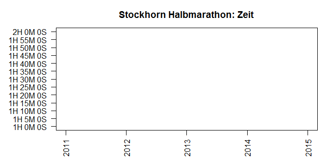

    ## 
    ## 
    ## Brienzerseelauf

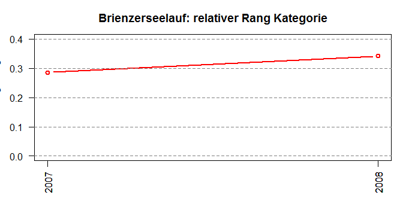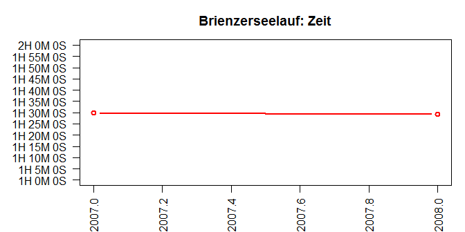

Relative Raenge
===============

Es werden nur Wettkaempfe mit mind. 2 Teilnahmen gezeigt.

Innerhalb Maenner ueber alle Wettkaempfe
----------------------------------------

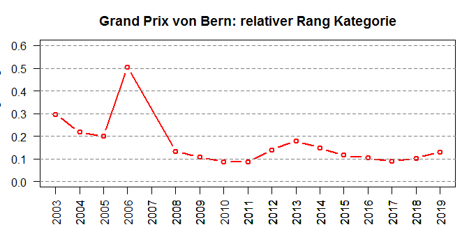

Innerhalb Alterskategorie ueber alle Wettkaempfe
------------------------------------------------

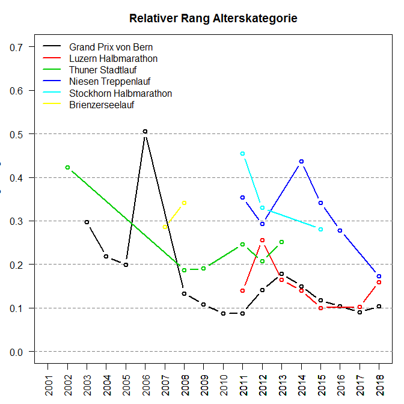
