Krafttraining
================
Kaspar Rufibach
27 Jan 2019

Analyse
=======

<table>
<colgroup>
<col width="36%" />
<col width="18%" />
<col width="18%" />
<col width="18%" />
<col width="9%" />
</colgroup>
<thead>
<tr class="header">
<th align="center"> </th>
<th align="center">Kieser</th>
<th align="center">Exersuisse</th>
<th align="center">Kieser 2</th>
<th align="center">Total</th>
</tr>
</thead>
<tbody>
<tr class="odd">
<td align="center">Anzahl Programme</td>
<td align="center">16</td>
<td align="center">27</td>
<td align="center">4</td>
<td align="center">47</td>
</tr>
<tr class="even">
<td align="center">Anzahl Trainings</td>
<td align="center">305</td>
<td align="center">506</td>
<td align="center">55</td>
<td align="center">866</td>
</tr>
<tr class="odd">
<td align="center">Erstes Training</td>
<td align="center">2005-05-07</td>
<td align="center">2011-01-12</td>
<td align="center">2017-11-23</td>
<td align="center"></td>
</tr>
<tr class="even">
<td align="center">Bisher letztes Training</td>
<td align="center">2011-01-10</td>
<td align="center">2017-11-15</td>
<td align="center">2019-01-22</td>
<td align="center"></td>
</tr>
</tbody>
</table>

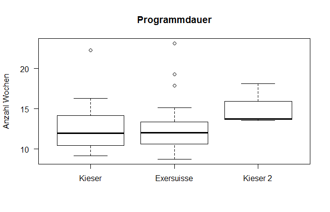

Uebungen des letzten absolvierten Programms
===========================================

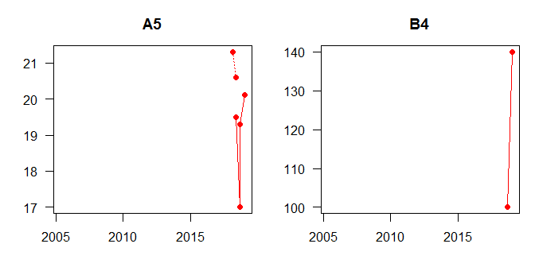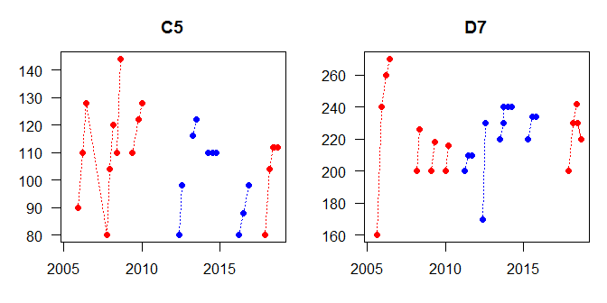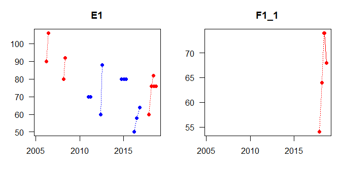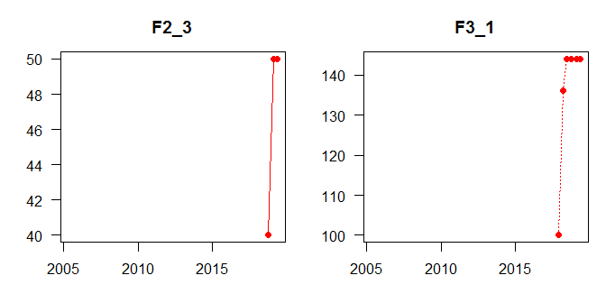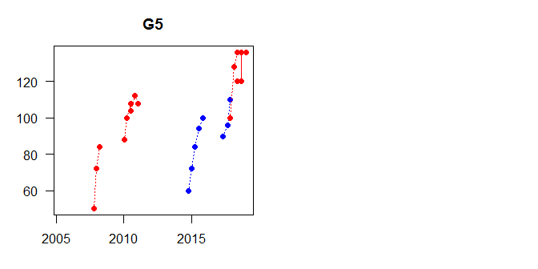

Alle Uebungen
=============

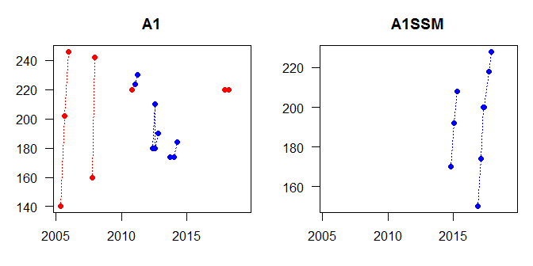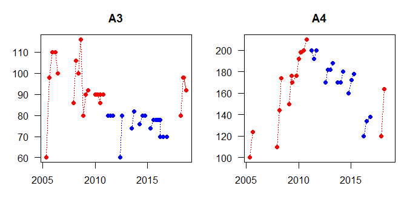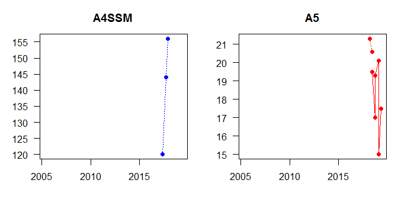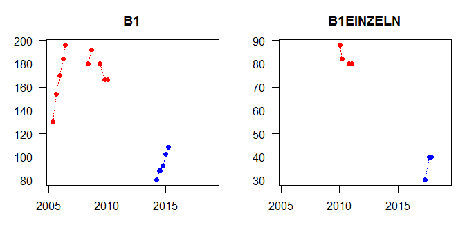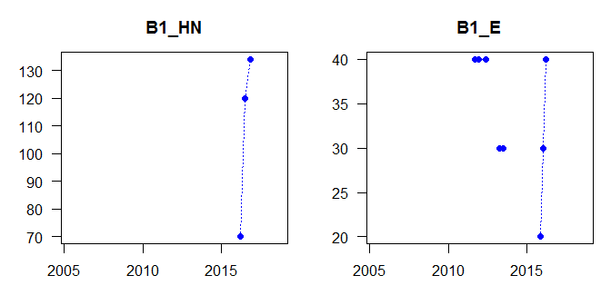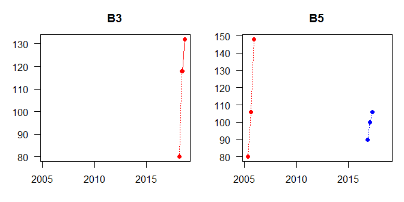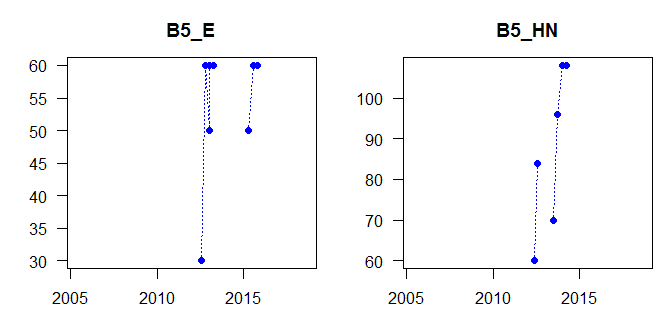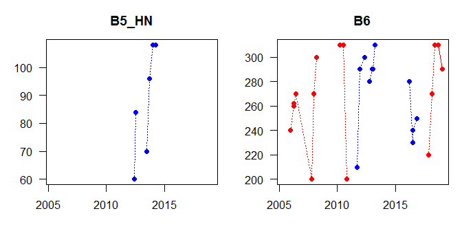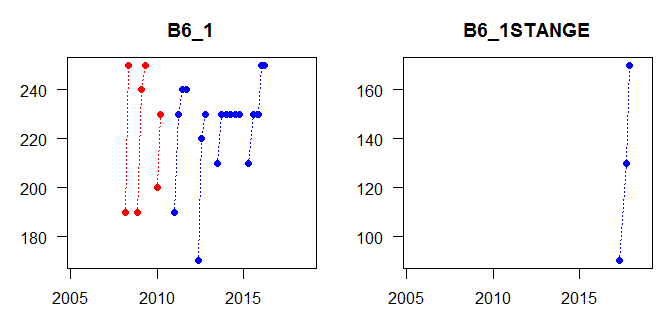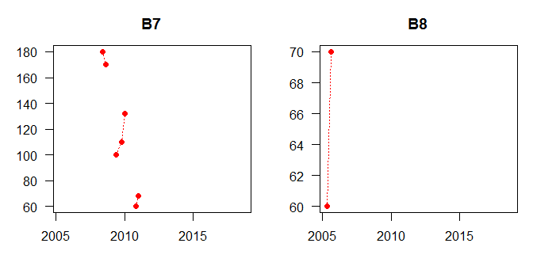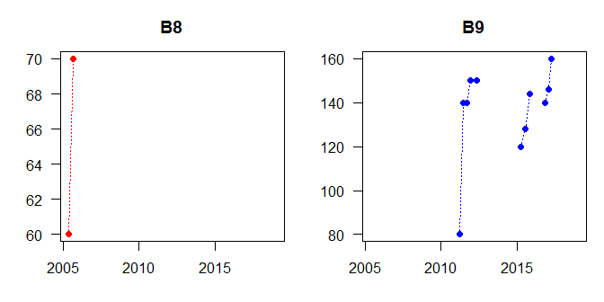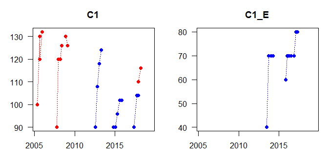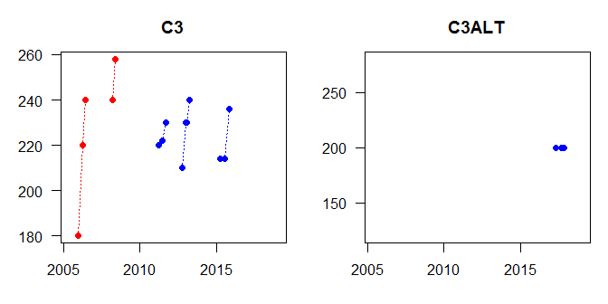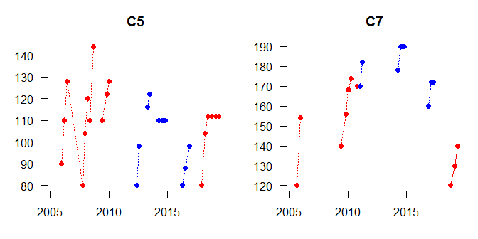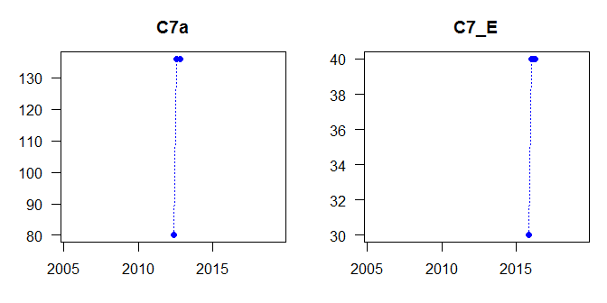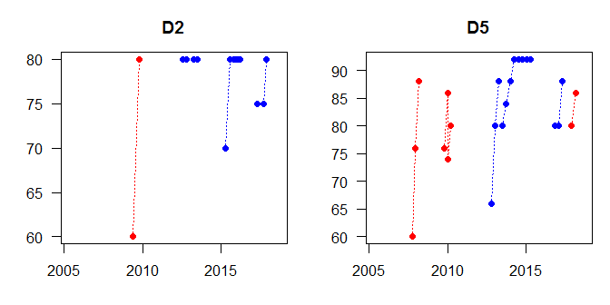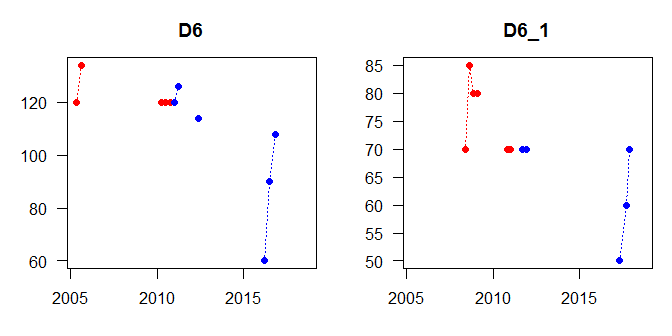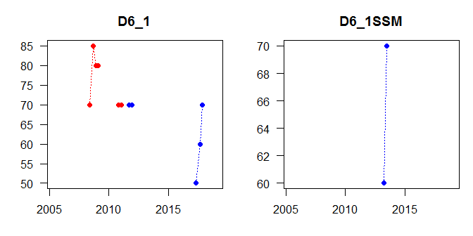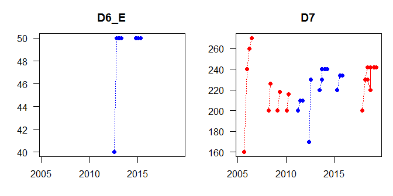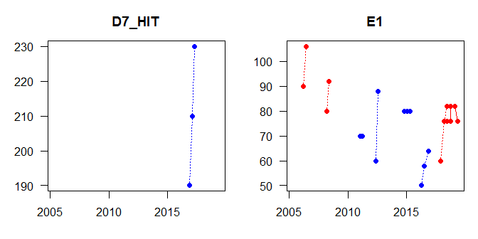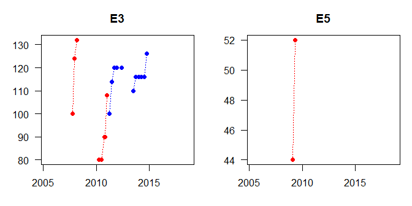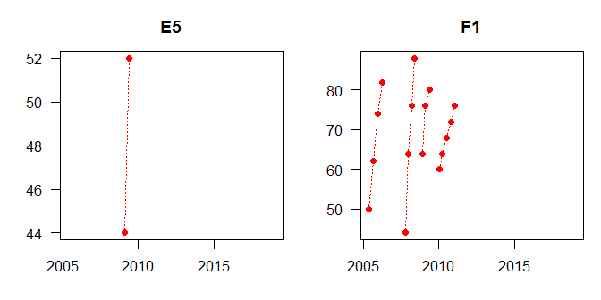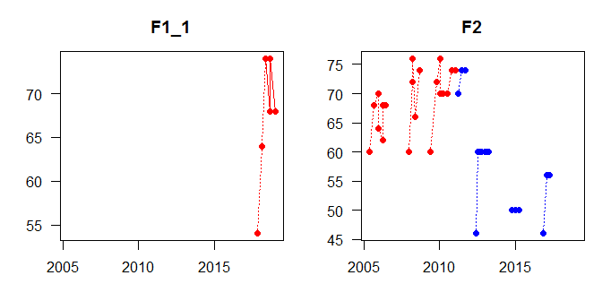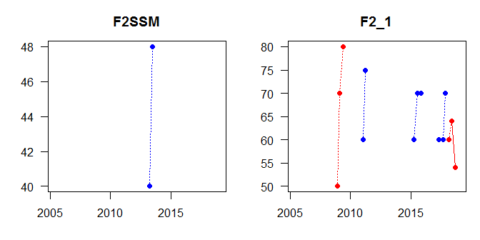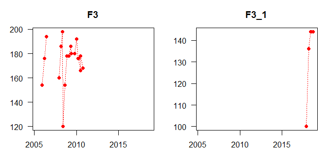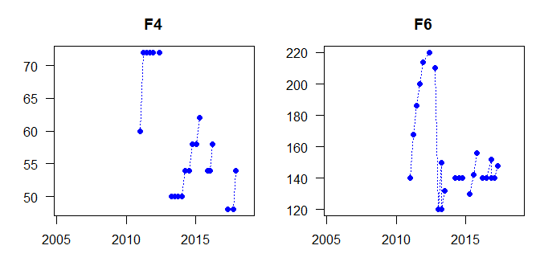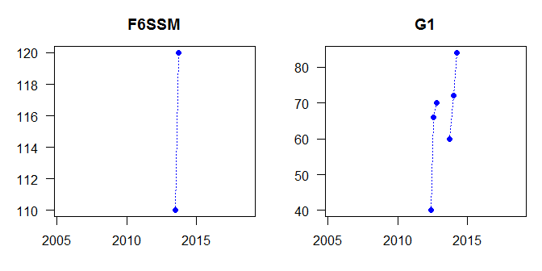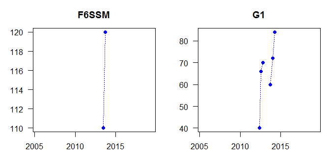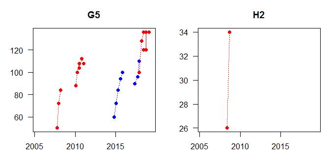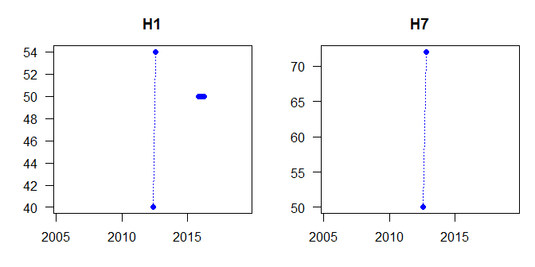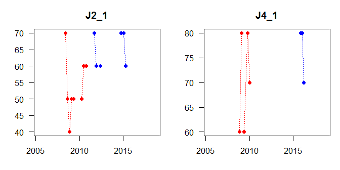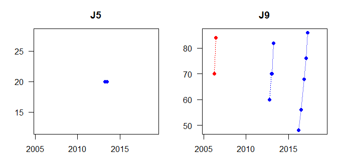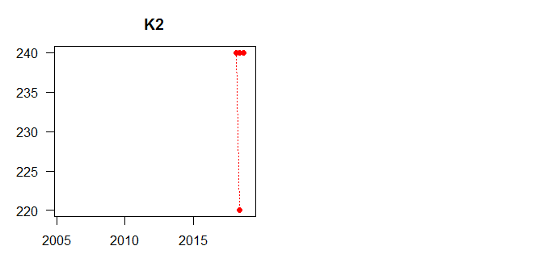
