Yearly summaries
================
Kaspar Rufibach
12 Aug 2019, as per 12th August

Numbers for 2019 are linearly extrapolated from 2019-08-12 to the full
year.

# Yearly summaries

## Kilometer

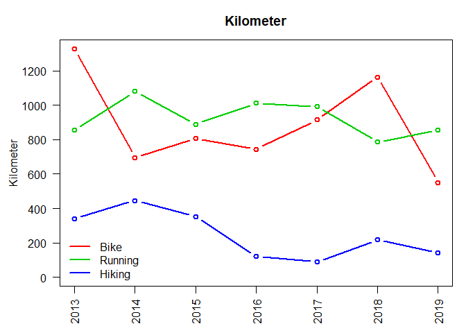

## Elevation gain

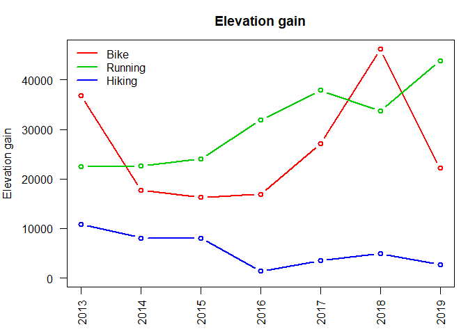

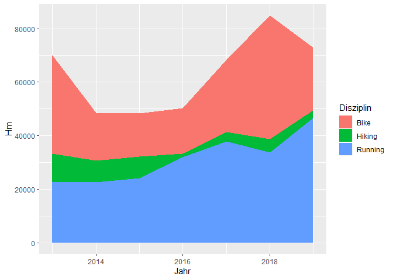

## Time

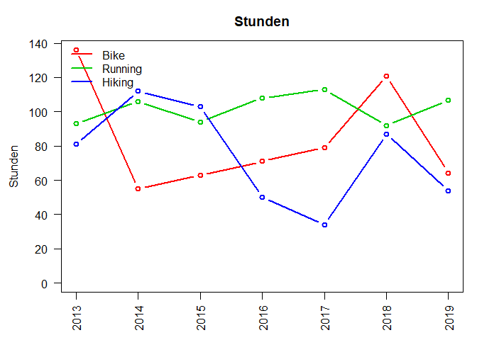

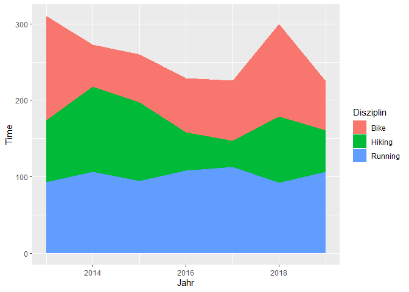

## Places

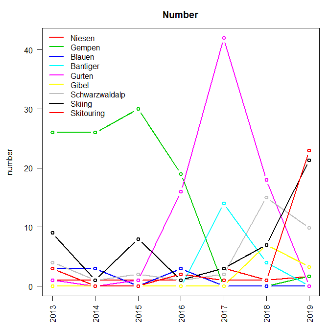

# Summary over winter seasons (not years)

## Skiing

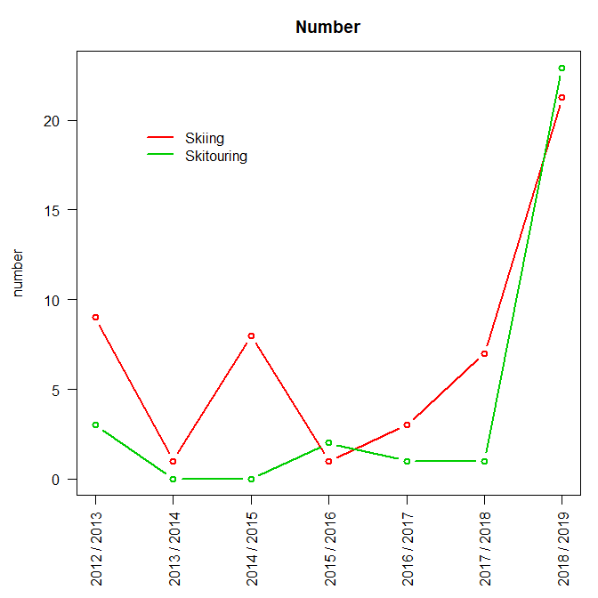

# Activity per year

Shaded red bars are linearly extrapolated from 2019-08-12 to the entire
year.

## Bike

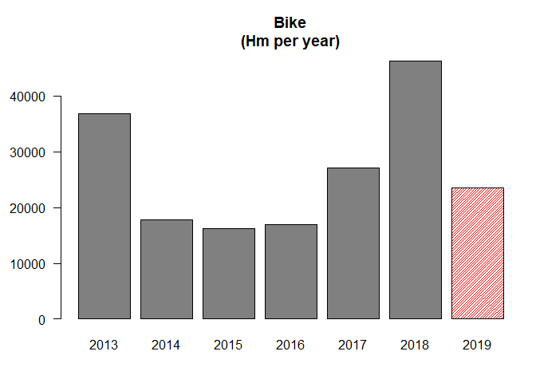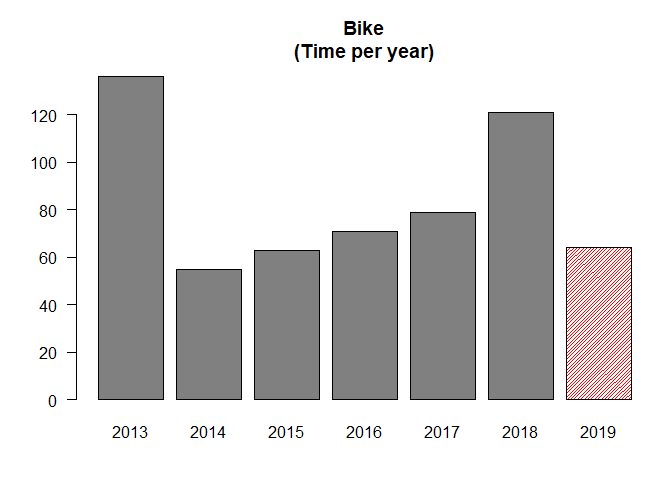

## Run

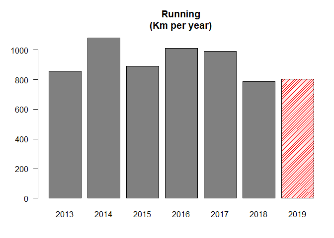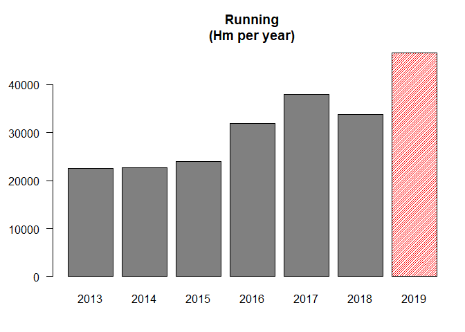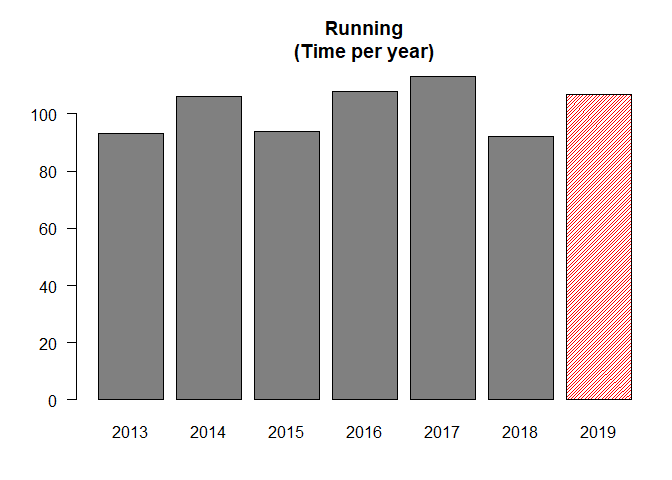

## Hiking

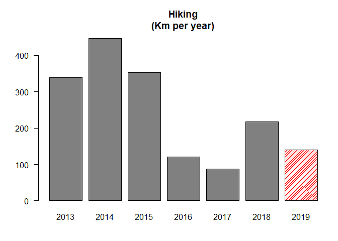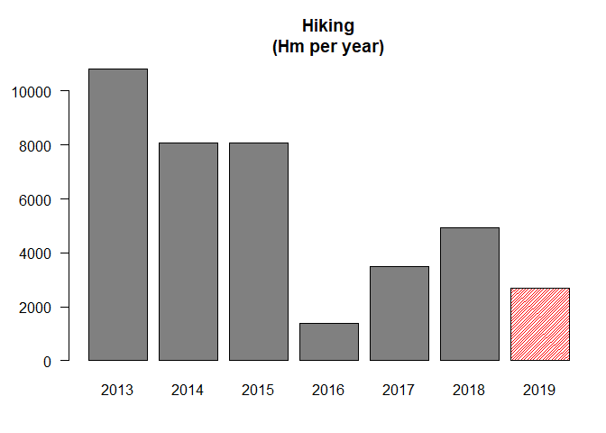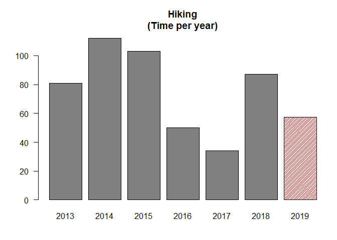

## Exersuisse

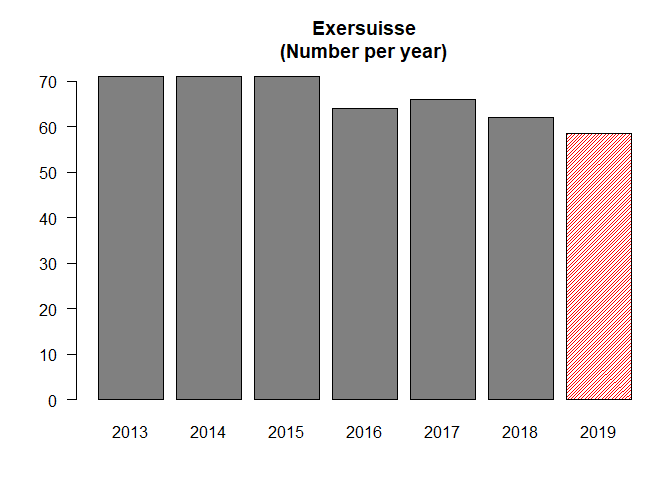

## Orte

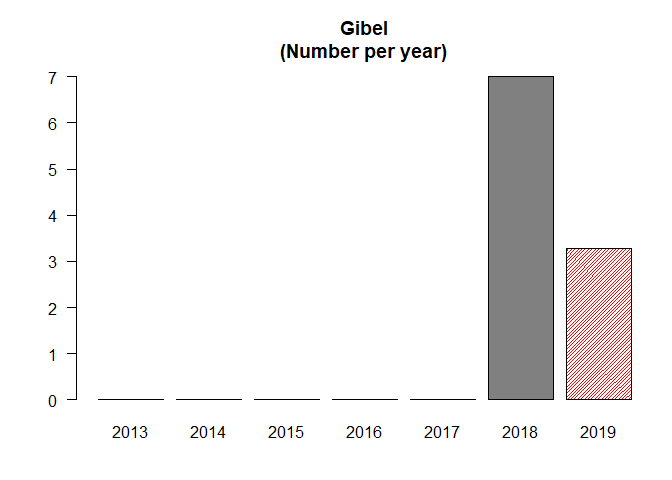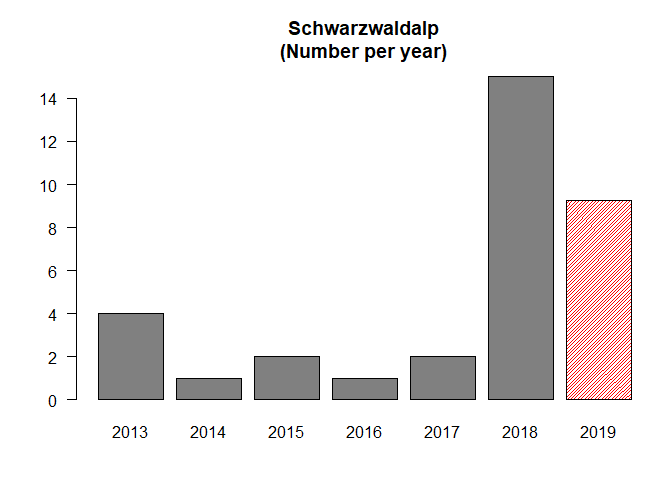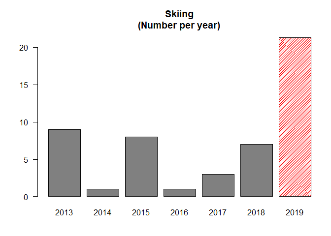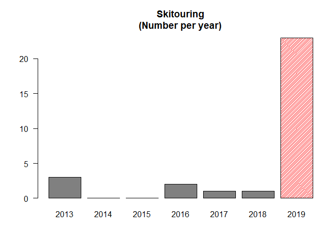

# Activity per week

## Bike

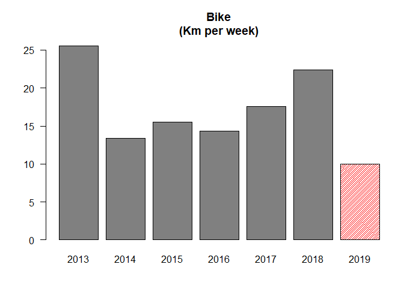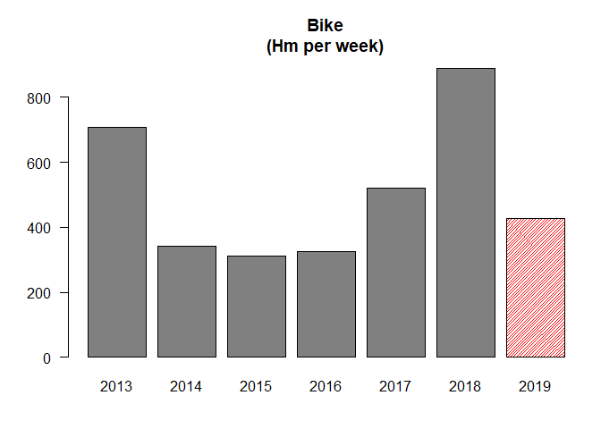

## Run

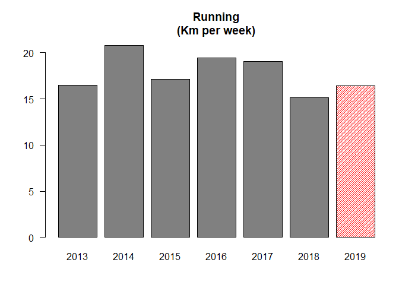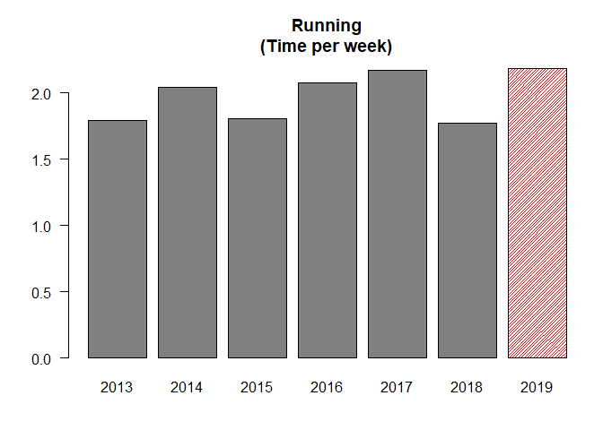

## Hiking

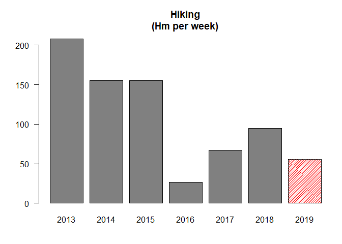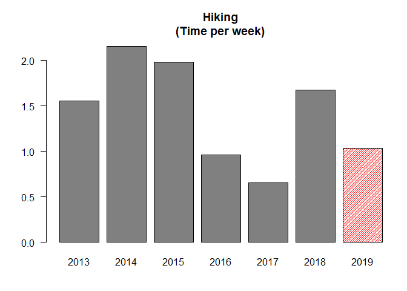

## Exersuisse

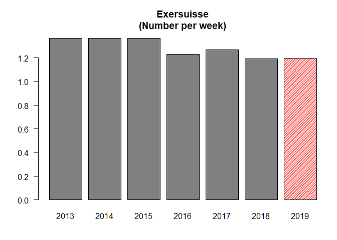
